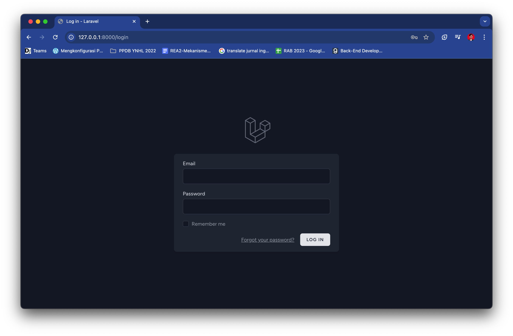
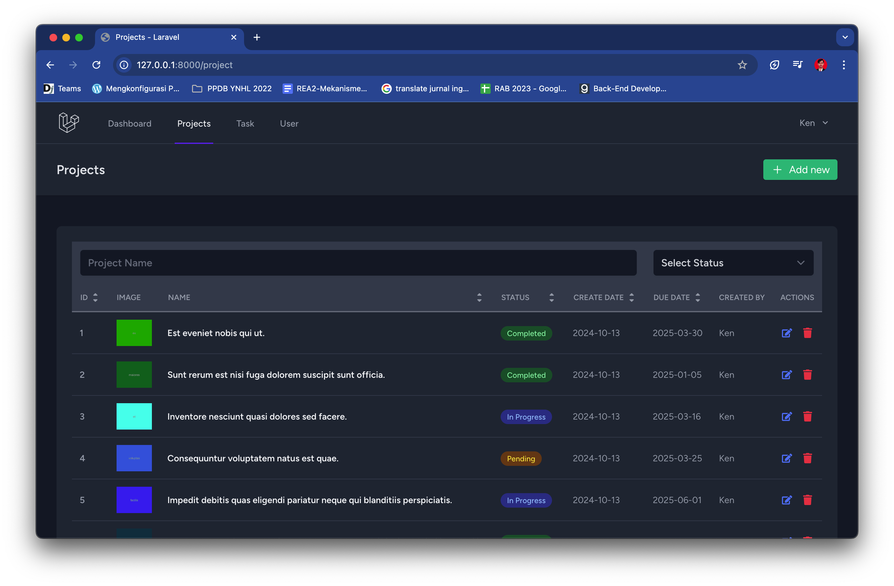

Setup Project
Backend
1. composer install
2. run this command `cp .env.example .env`
3. run this command `php artisan key:generate`
4. run this command `php artisan migrate && php artisan db:seed`

Frontend
1. run this command `npm install`
2. if any issue vulnerabilities run this command `npm audit fix`
3. run this command `npm run dev`

Run Project
1. npm run dev
2. php artisan serve

Project Feature
- Coverage by unit test

- UI
Login

Project Management

Tasks Management

Users Management
